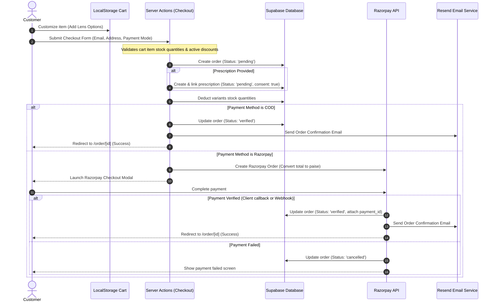
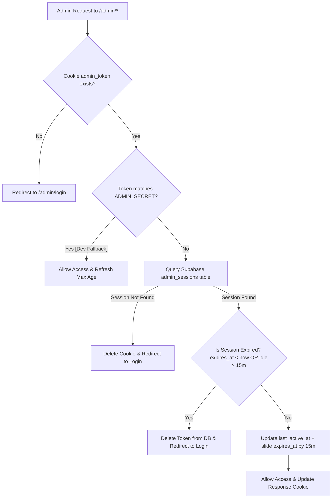

# Kaanchwala v2 — Project Specification & Blueprint

Kaanchwala v2 is a boutique, premium e-commerce platform specializing in prescription eyewear, sunglasses, and contact lenses. This document serves as a comprehensive system architecture design and feature specification required to recreate the project from scratch.

---

## 1. Technology Stack

The application is built using a modern, scalable, type-safe stack:

*   **Frontend Framework**: Next.js 16.2 (App Router) utilizing:
    *   Server Actions for secure mutation endpoints.
    *   Route Groups (`(store)`, `(auth)`, `(checkout)`, `(shop)`) for clean url routing.
    *   React 19 Server and Client Components.
*   **Styling & UI**: Tailwind CSS v4 with unified CSS variables, dynamic dark mode support, and micro-animations. Iconography powered by Lucide React, and toast notifications handled by Sonner.
*   **Database & Backend-as-a-Service**: Supabase:
    *   **PostgreSQL**: Houses relational tables, indexes, custom trigger functions, and security controls.
    *   **Supabase Auth**: Manages sign-up, sign-in, and JWT session handling.
    *   **Row-Level Security (RLS)**: Enforces table-level access rules directly in the database.
    *   **Supabase Storage**:
        *   `prescriptions`: Private bucket for secure, regulatory-compliant prescription document uploads.
        *   `product-images`: Public bucket for hosting high-resolution product catalog photos.
*   **Payment Processing**: Razorpay API:
    *   Prepaid transaction handling via client-side SDK checkouts.
    *   Automated background payments verification and cancellation handling via API webhooks.
    *   In-dashboard refund processing utilizing the Razorpay Node SDK.
*   **Transactional Emails**: Resend API:
    *   Dispatches responsive HTML emails for order confirmation, shipping alerts (with tracking links), prescription reception, and targeted marketing campaigns.
*   **Data Validation**: Zod schemas for sanitizing input variables across form fills, API requests, and server action parameters.

---

## 2. Architecture & Data Flows

A core design requirement is the tight, multi-layered linkage between users, their carts, uploaded prescriptions, final orders, and the admin fulfillment dashboard.

### 2.1 The Interconnected Checkout & Order Flow

The lifecycle of an order involves matching catalog items with customized configurations, verifying payment statuses, and attaching user records:



### 2.2 Security Architecture & Admin Middleware

To prevent unauthorized access to administrative modules, Kaanchwala v2 implements a sliding session mechanism managed via middleware:



---

## 3. Database Schema Blueprint (Supabase SQL)

Create these database objects inside the Supabase PostgreSQL console or via migration files:

```sql
-- ===========================================
-- Enums
-- ===========================================
CREATE TYPE user_role AS ENUM ('customer', 'admin');
CREATE TYPE product_category AS ENUM ('eyeglasses', 'sunglasses', 'contact_lenses');
CREATE TYPE order_status AS ENUM ('pending', 'verified', 'processing', 'shipped', 'delivered', 'cancelled');
CREATE TYPE prescription_status AS ENUM ('pending', 'approved', 'rejected');
CREATE TYPE discount_type AS ENUM ('percentage', 'fixed');
CREATE TYPE return_status AS ENUM ('none', 'requested', 'approved', 'refunded', 'exchanged');
CREATE TYPE payment_method AS ENUM ('razorpay', 'cod');

-- ===========================================
-- Tables
-- ===========================================

-- Profiles (extends auth.users)
CREATE TABLE profiles (
  id UUID PRIMARY KEY REFERENCES auth.users(id) ON DELETE CASCADE,
  role user_role NOT NULL DEFAULT 'customer',
  full_name TEXT,
  phone TEXT,
  created_at TIMESTAMPTZ NOT NULL DEFAULT NOW(),
  updated_at TIMESTAMPTZ NOT NULL DEFAULT NOW()
);

-- Products
CREATE TABLE products (
  id UUID PRIMARY KEY DEFAULT uuid_generate_v4(),
  title TEXT NOT NULL,
  description TEXT,
  base_price NUMERIC(10, 2) NOT NULL CHECK (base_price >= 0),
  discount_price NUMERIC(10, 2) CHECK (discount_price >= 0),
  category product_category NOT NULL,
  is_premium BOOLEAN NOT NULL DEFAULT FALSE,
  is_active BOOLEAN NOT NULL DEFAULT TRUE,
  return_eligible BOOLEAN NOT NULL DEFAULT TRUE,
  image_urls TEXT[] DEFAULT '{}',
  created_at TIMESTAMPTZ NOT NULL DEFAULT NOW(),
  updated_at TIMESTAMPTZ NOT NULL DEFAULT NOW()
);

-- Variants (SKU specific colors per product)
CREATE TABLE variants (
  id UUID PRIMARY KEY DEFAULT uuid_generate_v4(),
  product_id UUID NOT NULL REFERENCES products(id) ON DELETE CASCADE,
  color TEXT NOT NULL,
  sku TEXT UNIQUE NOT NULL,
  stock_quantity INTEGER NOT NULL DEFAULT 0 CHECK (stock_quantity >= 0),
  is_in_stock BOOLEAN NOT NULL DEFAULT TRUE,
  image_url TEXT,
  created_at TIMESTAMPTZ NOT NULL DEFAULT NOW(),
  updated_at TIMESTAMPTZ NOT NULL DEFAULT NOW()
);

-- Orders
CREATE TABLE orders (
  id UUID PRIMARY KEY DEFAULT uuid_generate_v4(),
  customer_email TEXT NOT NULL,
  user_id UUID REFERENCES auth.users(id) ON DELETE SET NULL,
  status order_status NOT NULL DEFAULT 'pending',
  payment_method payment_method NOT NULL DEFAULT 'razorpay',
  razorpay_order_id TEXT,
  razorpay_payment_id TEXT,
  subtotal NUMERIC(10, 2) NOT NULL DEFAULT 0,
  shipping_fee NUMERIC(10, 2) NOT NULL DEFAULT 0,
  discount_amount NUMERIC(10, 2) NOT NULL DEFAULT 0,
  total NUMERIC(10, 2) NOT NULL DEFAULT 0,
  shipping_address JSONB NOT NULL DEFAULT '{}',
  tracking_number TEXT,
  courier TEXT,
  return_status return_status NOT NULL DEFAULT 'none',
  discount_code TEXT,
  created_at TIMESTAMPTZ NOT NULL DEFAULT NOW(),
  updated_at TIMESTAMPTZ NOT NULL DEFAULT NOW()
);

-- Order Items
CREATE TABLE order_items (
  id UUID PRIMARY KEY DEFAULT uuid_generate_v4(),
  order_id UUID NOT NULL REFERENCES orders(id) ON DELETE CASCADE,
  product_id UUID NOT NULL REFERENCES products(id) ON DELETE RESTRICT,
  variant_id UUID REFERENCES variants(id) ON DELETE SET NULL,
  lens_add_ons JSONB DEFAULT '[]', -- Stores array: [{"name": "Blue-Cut", "price": 500}]
  quantity INTEGER NOT NULL DEFAULT 1 CHECK (quantity > 0),
  unit_price NUMERIC(10, 2) NOT NULL CHECK (unit_price >= 0),
  created_at TIMESTAMPTZ NOT NULL DEFAULT NOW()
);

-- Prescriptions (DPDP Act Consent Compliant)
CREATE TABLE prescriptions (
  id UUID PRIMARY KEY DEFAULT uuid_generate_v4(),
  user_id UUID REFERENCES auth.users(id) ON DELETE SET NULL,
  order_id UUID REFERENCES orders(id) ON DELETE CASCADE,
  sph_r NUMERIC(5, 2),
  cyl_r NUMERIC(5, 2),
  axis_r INTEGER CHECK (axis_r >= 0 AND axis_r <= 180),
  add_r NUMERIC(4, 2),
  sph_l NUMERIC(5, 2),
  cyl_l NUMERIC(5, 2),
  axis_l INTEGER CHECK (axis_l >= 0 AND axis_l <= 180),
  add_l NUMERIC(4, 2),
  pd NUMERIC(4, 1),
  prescription_url TEXT,
  status prescription_status NOT NULL DEFAULT 'pending',
  dpdp_consent BOOLEAN NOT NULL DEFAULT FALSE,
  notes TEXT,
  created_at TIMESTAMPTZ NOT NULL DEFAULT NOW(),
  updated_at TIMESTAMPTZ NOT NULL DEFAULT NOW()
);

-- Discounts
CREATE TABLE discounts (
  id UUID PRIMARY KEY DEFAULT uuid_generate_v4(),
  code TEXT UNIQUE NOT NULL,
  type discount_type NOT NULL,
  value NUMERIC(10, 2) NOT NULL CHECK (value > 0),
  min_order_amount NUMERIC(10, 2) DEFAULT 0,
  valid_from TIMESTAMPTZ NOT NULL DEFAULT NOW(),
  valid_to TIMESTAMPTZ NOT NULL,
  usage_limit INTEGER DEFAULT NULL,
  usage_count INTEGER NOT NULL DEFAULT 0,
  is_active BOOLEAN NOT NULL DEFAULT TRUE,
  created_at TIMESTAMPTZ NOT NULL DEFAULT NOW()
);

-- Admin Sessions
CREATE TABLE admin_sessions (
  id UUID PRIMARY KEY DEFAULT uuid_generate_v4(),
  created_at TIMESTAMPTZ NOT NULL DEFAULT NOW(),
  last_active_at TIMESTAMPTZ NOT NULL DEFAULT NOW(),
  expires_at TIMESTAMPTZ NOT NULL DEFAULT NOW() + INTERVAL '15 minutes'
);

-- Admin Audit Logs
CREATE TABLE admin_logs (
  id UUID PRIMARY KEY DEFAULT uuid_generate_v4(),
  action TEXT NOT NULL,
  details JSONB NOT NULL DEFAULT '{}',
  created_at TIMESTAMPTZ NOT NULL DEFAULT NOW()
);

-- ===========================================
-- Indexes
-- ===========================================
CREATE INDEX idx_products_category ON products(category);
CREATE INDEX idx_products_is_active ON products(is_active);
CREATE INDEX idx_products_is_premium ON products(is_premium);
CREATE INDEX idx_variants_product_id ON variants(product_id);
CREATE INDEX idx_variants_sku ON variants(sku);
CREATE INDEX idx_orders_user_id ON orders(user_id);
CREATE INDEX idx_orders_customer_email ON orders(customer_email);
CREATE INDEX idx_orders_status ON orders(status);
CREATE INDEX idx_order_items_order_id ON order_items(order_id);
CREATE INDEX idx_prescriptions_order_id ON prescriptions(order_id);
CREATE INDEX idx_prescriptions_user_id ON prescriptions(user_id);
CREATE INDEX idx_discounts_code ON discounts(code);

-- ===========================================
-- Triggers and Functions
-- ===========================================

-- Auto-create profile on Auth signup
CREATE OR REPLACE FUNCTION public.handle_new_user()
RETURNS TRIGGER AS $$
BEGIN
  INSERT INTO public.profiles (id, full_name)
  VALUES (NEW.id, COALESCE(NEW.raw_user_meta_data->>'full_name', ''));
  RETURN NEW;
END;
$$ LANGUAGE plpgsql SECURITY DEFINER;

CREATE TRIGGER on_auth_user_created
  AFTER INSERT ON auth.users
  FOR EACH ROW EXECUTE FUNCTION public.handle_new_user();

-- Automatic stock status sync
CREATE OR REPLACE FUNCTION sync_stock_status()
RETURNS TRIGGER AS $$
BEGIN
  NEW.is_in_stock := NEW.stock_quantity > 0;
  NEW.updated_at := NOW();
  RETURN NEW;
END;
$$ LANGUAGE plpgsql;

CREATE TRIGGER on_variant_stock_change
  BEFORE UPDATE OF stock_quantity ON variants
  FOR EACH ROW EXECUTE FUNCTION sync_stock_status();

-- Auto-update timestamps trigger
CREATE OR REPLACE FUNCTION update_updated_at()
RETURNS TRIGGER AS $$
BEGIN
  NEW.updated_at := NOW();
  RETURN NEW;
END;
$$ LANGUAGE plpgsql;

CREATE TRIGGER update_profiles_updated_at BEFORE UPDATE ON profiles FOR EACH ROW EXECUTE FUNCTION update_updated_at();
CREATE TRIGGER update_products_updated_at BEFORE UPDATE ON products FOR EACH ROW EXECUTE FUNCTION update_updated_at();
CREATE TRIGGER update_orders_updated_at BEFORE UPDATE ON orders FOR EACH ROW EXECUTE FUNCTION update_updated_at();
CREATE TRIGGER update_prescriptions_updated_at BEFORE UPDATE ON prescriptions FOR EACH ROW EXECUTE FUNCTION update_updated_at();

-- ===========================================
-- Row Level Security (RLS) Policies
-- ===========================================
ALTER TABLE profiles ENABLE ROW LEVEL SECURITY;
ALTER TABLE products ENABLE ROW LEVEL SECURITY;
ALTER TABLE variants ENABLE ROW LEVEL SECURITY;
ALTER TABLE orders ENABLE ROW LEVEL SECURITY;
ALTER TABLE order_items ENABLE ROW LEVEL SECURITY;
ALTER TABLE prescriptions ENABLE ROW LEVEL SECURITY;
ALTER TABLE discounts ENABLE ROW LEVEL SECURITY;

-- Profiles Policies
CREATE POLICY "Users can view own profile" ON profiles FOR SELECT USING (auth.uid() = id);
CREATE POLICY "Users can update own profile" ON profiles FOR UPDATE USING (auth.uid() = id) WITH CHECK (auth.uid() = id);
CREATE POLICY "Admins can view all profiles" ON profiles FOR SELECT USING (
  EXISTS (SELECT 1 FROM profiles WHERE id = auth.uid() AND role = 'admin')
);

-- Products Policies
CREATE POLICY "Anyone can view active products" ON products FOR SELECT USING (is_active = TRUE);
CREATE POLICY "Admins can manage products" ON products FOR ALL USING (
  EXISTS (SELECT 1 FROM profiles WHERE id = auth.uid() AND role = 'admin')
);

-- Variants Policies
CREATE POLICY "Anyone can view variants of active products" ON variants FOR SELECT USING (
  EXISTS (SELECT 1 FROM products WHERE id = variants.product_id AND is_active = TRUE)
);
CREATE POLICY "Admins can manage variants" ON variants FOR ALL USING (
  EXISTS (SELECT 1 FROM profiles WHERE id = auth.uid() AND role = 'admin')
);

-- Orders Policies
CREATE POLICY "Users can view own orders" ON orders FOR SELECT USING (auth.uid() = user_id);
CREATE POLICY "Users can insert orders" ON orders FOR INSERT WITH CHECK (TRUE);
CREATE POLICY "Admins can manage all orders" ON orders FOR ALL USING (
  EXISTS (SELECT 1 FROM profiles WHERE id = auth.uid() AND role = 'admin')
);

-- Order Items Policies
CREATE POLICY "Users can view own order items" ON order_items FOR SELECT USING (
  EXISTS (SELECT 1 FROM orders WHERE id = order_items.order_id AND user_id = auth.uid())
);
CREATE POLICY "Users can insert order items" ON order_items FOR INSERT WITH CHECK (TRUE);
CREATE POLICY "Admins can manage all order items" ON order_items FOR ALL USING (
  EXISTS (SELECT 1 FROM profiles WHERE id = auth.uid() AND role = 'admin')
);

-- Prescriptions Policies
CREATE POLICY "Users can view own prescriptions" ON prescriptions FOR SELECT USING (auth.uid() = user_id);
CREATE POLICY "Users can insert prescriptions" ON prescriptions FOR INSERT WITH CHECK (auth.uid() = user_id OR user_id IS NULL);
CREATE POLICY "Admins can manage all prescriptions" ON prescriptions FOR ALL USING (
  EXISTS (SELECT 1 FROM profiles WHERE id = auth.uid() AND role = 'admin')
);

-- Discounts Policies
CREATE POLICY "Anyone can view active valid discounts" ON discounts FOR SELECT USING (
  is_active = TRUE AND valid_from <= NOW() AND valid_to >= NOW() AND (usage_limit IS NULL OR usage_count < usage_limit)
);
CREATE POLICY "Admins can manage discounts" ON discounts FOR ALL USING (
  EXISTS (SELECT 1 FROM profiles WHERE id = auth.uid() AND role = 'admin')
);
```

---

## 4. Key Feature Implementation Details

### 4.1 Client-Side Cart & Customizations
*   **State Management**: Handled via `CartProvider.tsx` context with `localStorage` syncing.
*   **Customization Options**: Eyeglasses can be customized with lens packages (`Blue-Cut Lens` @ ₹500, `Photochromic Lens` @ ₹800).
*   **Item Key Generation**: Cart configurations generate unique compound identifiers formatted as:
    `[product_id]_[variant_id || "none"]_[sorted_lens_add_ons_joined_by_underscores]`.
    This prevents duplicate entries when a user adds the same frame with different lens options.

### 4.2 Checkout Engine & Coupon Logic
*   **Price Calculations**: Subtotal is compiled. Shipping fees are dynamically applied based on order weight or price tiers.
*   **Coupon Redemption**: Codes are cross-referenced with `discounts` table. Validates starting/ending timestamps, total remaining usage capacity (`usage_limit`), and minimum basket value requirement.
*   **Stock Reservation**: Variants database stock is decremented immediately during the transaction insert to avoid race conditions.

### 4.3 Integrated Prescription System
*   **Modes of Entry**:
    1.  *Manual Form*: Inputs Right/Left parameters: Spherical (SPH), Cylindrical (CYL), Axis, and Near Addition (ADD) along with Pupillary Distance (PD).
    2.  *Upload Document*: Uploads PDF or image copy of physical prescriptions.
*   **Compliance Protocol**: Requires explicit check-box agreement confirming compliance with the Digital Personal Data Protection (DPDP) Act before saving data.
*   **Storage Access Control**: Files are uploaded to private bucket folders grouped under `${user_id}/`. Public signed links are retrieved strictly on-demand.

### 4.4 Razorpay Webhook Gateway
*   **Webhook Listener (`/api/webhooks/razorpay`)**: Validates SHA-256 HMAC payload signatures from the payment server.
*   **Webhook Operations**:
    *   `payment.captured`: Confirms order transaction status to `verified`, registers the transaction id, and dispatches the HTML confirmation invoice via Resend.
    *   `payment.failed`: Automatically flags transaction status to `cancelled`, freeing up stock limits.

### 4.5 Secured Admin Dashboard & Marketing Engine
*   **Dashboard Panels**:
    *   *Real-time Metrics*: Revenue aggregation, inventory depletion alarms, pending prescriptions, and pending orders.
    *   *Inventory Controller*: Form editors for adding products/variants, batch upload utilities, and storage bucketing.
    *   *Fulfillment Center*: Courier details mapping and automated refund triggers via Razorpay.
    *   *Prescription Assessor*: Admin interface to approve/reject manual values or uploaded files. Rejection triggers notes updates.
    *   *Discounts Manager*: Coupon management panel.
    *   *Promotional Outreach*: Dispatch engines supporting email campaigns (via Resend) or simulating WhatsApp campaigns. Selects targets (all members, order-making customers, or custom list) with administrative logging.

---

## 5. Step-by-Step Implementation Guide

Recreate this system systematically by following these execution phases:

### Phase 1: Database Setup
1. Establish a new Supabase Project.
2. Execute the schema SQL from Section 3 inside the SQL Editor.
3. Construct the storage buckets:
   *   `product-images`: Configure to **Public** read permissions.
   *   `prescriptions`: Configure to **Private** read permissions (restricted by RLS).

### Phase 2: Environment Variables
Create a local `.env.local` containing the following connection details:
```env
NEXT_PUBLIC_SUPABASE_URL=your_supabase_url
NEXT_PUBLIC_SUPABASE_PUBLISHABLE_KEY=your_supabase_anon_key
SUPABASE_SECRET_KEY=your_supabase_service_role_key

RAZORPAY_KEY_ID=your_razorpay_key_id
RAZORPAY_KEY_SECRET=your_razorpay_key_secret
RAZORPAY_WEBHOOK_SECRET=your_razorpay_webhook_secret

RESEND_API_KEY=your_resend_api_key
NEXT_PUBLIC_APP_URL=http://localhost:3000

ADMIN_SECRET=your_static_fallback_admin_secret
```

### Phase 3: Auth & Account Setup
1. Configure client-side and server-side Supabase clients (`@supabase/ssr`).
2. Build login and registration pages using Server Actions (`signIn`, `signUp`).
3. Set up the `profiles` table link. Implement guest checkout and user profile updates.

### Phase 4: Product Catalog & Cart
1. Create product cards, list filters, and details views using Next.js routes.
2. Develop the client-side React cart context (`CartProvider`) supporting lens add-ons and compound keys.
3. Integrate real-time database checks to block checkout of out-of-stock items.

### Phase 5: Payment Gateway & Order Placement
1. Implement the `createOrder` Server Action:
   *   Validate address schema (Zod).
   *   Calculate totals, apply coupons, and insert order data.
   *   Create Razorpay transaction order.
2. Add checkout payment modal using the Razorpay script interface.
3. Implement `/api/webhooks/razorpay` to process server-to-server transaction logs.

### Phase 6: Prescription Integration
1. Set up prescription form validation schema.
2. Build file upload action (`uploadPrescriptionFile`) writing to the secure `prescriptions` bucket.
3. Link the prescription record to the order row. Include the DPDP compliance consent constraint.

### Phase 7: Secure Admin Dashboard
1. Implement the admin session authorization middleware (`src/proxy.ts` or `src/middleware.ts`).
2. Build the admin dashboard UI grid displaying real-time metrics.
3. Write order management interfaces (status updates, tracking, refunds).
4. Code the discount code creator and promotional campaign dispatcher.
